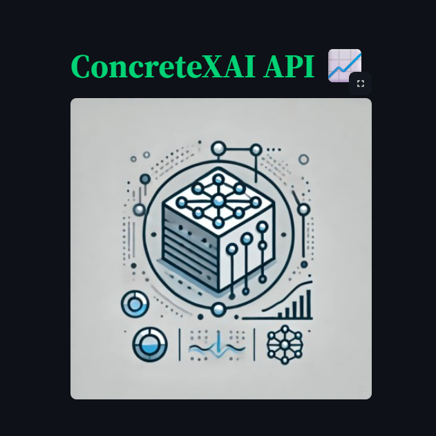

## ConcreteXAI API

<div align="center">




**Interactive Concrete Performance Prediction with Explainable AI**

**Next-generation web application for non-destructive concrete strength estimation and explainable machine learning**

</div>

:star2: Overview

ConcreteXAI API is an innovative web application designed to empower civil engineers, researchers, and practitioners with instant, explainable predictions of concrete compressive strength using non-destructive test data. Built with Streamlit for seamless interactivity and powered by deep learning, this tool bridges the gap between advanced AI and practical engineering needs.

- ## :gear: Key Features
  
- **:rocket: Instant Predictions**: Real-time compressive strength estimation from user inputs
- **:microscope: Explainable AI**: Transparent model outputs for trustworthy decision-making
- **:abacus: Advanced ML**: Deep learning models trained on real experimental datasets
- **:art: Intuitive UI**: Clean, responsive interface with custom branding and animations
- **:wrench: Modular Design**: Easily extensible for new features and datasets
- **:bar_chart: Data Scaling**: Automated input normalization for robust predictions
- **:lock: Privacy First**: No data stored—inputs processed in-memory for user confidentiality

### :construction_worker: Applications

| Field | Application | Use Case |
|-------|-------------|----------|
| **Civil Engineering** :building_construction: | Quality Control | On-site strength estimation, rapid assessment |
| **Materials Science** :test_tube: | Research | Experimental data analysis, model validation |
| **Construction** :hammer: | Project Management | Real-time monitoring, risk mitigation |
| **Education** :mortar_board: | Teaching | Interactive learning for students and professionals |
| **AI in Engineering** :robot: | Model Deployment | Demonstration of explainable ML in infrastructure |

---

## :gear: Technical Specifications

### Prediction Model

- **Inputs**:  
  - Design F'c (MPa)  
  - Curing Age (Days)  
  - Electrical Resistivity (Ω-cm)  
  - Ultrasonic Pulse Velocity (m/s)
- **Output**:  
  - Predicted Compressive Strength (MPa)
- **Model**:  
  - TensorFlow/Keras deep neural network (pre-trained)
- **Preprocessing**:  
  - StandardScaler normalization (scikit-learn)
- **Data Source**:  
  - Real experimental dataset (CSV)

### User Interface

- **Framework**: Streamlit
- **Custom Branding**: Institutional logos, sidebar background
- **Animations**: Lottie integration for engaging feedback
- **Accessibility**: Responsive layout, clear instructions, error handling

### Workflow

1. **User Input**: Enter test values via interactive form
2. **Preprocessing**: Inputs normalized using dataset statistics
3. **Prediction**: Model computes compressive strength
4. **Feedback**: Results displayed with success animation and clear messaging

---

## :open_file_folder: Project Architecture
Core Components
```
📦 ConcreteXAI_API/
├── main.py                   # Streamlit app entry point
├── Utilities.py              # UI helpers (background, etc.)
├── About.py                  # App information
├── Concrete_X_API_0.1.py     # Navigation page of the app
├── Models/
│   └── model_weights_best.hdf5   # Trained neural network weights
├── Images/
│   ├── logo.webp                 # App logo
│   ├── Sidebar.png               # Sidebar background
│   ├── logotipo_SCyT.svg         # Institutional logo
│   ├── logo_siiia_w.png          # Institutional logo
│   └── UMSNH.png                 # Institutional logo
├── Gifs/
│   └── Rocket.json               # Lottie animation
├── Model_creation/
│   └── Codes/
│       └── 1_Data_analysis/
│       |    └── Data.csv         # Reference dataset for scaling
|       └── 2_DNN_model/          # Model that was employed to get the weights
├── requirements.txt              # Python dependencies
└── README.md                     # Project documentation
```

---

## :package: Installation & Setup

### :computer: System Requirements

| Component | Minimum | Recommended |
|-----------|---------|-------------|
| **Python** | 3.8+ | 3.10+ |
| **RAM** | 2 GB | 8 GB+ |
| **CPU** | 2 cores | 4+ cores |
| **OS** | Windows/Linux/macOS | Windows 10+/Linux |

### :package: Dependencies

``` python
# Core
streamlit >= 1.20.0
numpy >= 1.20.0
pandas >= 1.3.0
scikit-learn >= 0.24.0
tensorflow >= 2.8.0

# UI Enhancements
streamlit-extras
streamlit-lottie

# Utilities
json
```
---
🚀 Quick installation 
```
1. Clone the repository

git clone https://github.com/JaGuzmanT/ConcreteXAI_API.git
cd ConcreteXAI_API

# Install dependencies
pip install -r 

# Run the Streamlit app
streamlit run
```

## :abacus: Methodology & Algorithms

### :books: Machine Learning Pipeline

1. **Data Collection**: Experimental results from non-destructive tests
2. **Feature Engineering**: Selection of relevant predictors (F'c, age, resistivity, UPV)
3. **Normalization**: StandardScaler fit on reference dataset
4. **Model Training**: Deep neural network (TensorFlow/Keras)
5. **Deployment**: Model weights loaded in Streamlit app for inference

### :trophy: Why ConcreteXAI?

| Feature         | Traditional Methods    | ConcreteXAI API           |
|-----------------|-----------------------|---------------------------|
| **Speed**       | Manual calculation    | Instant prediction        |
| **Accuracy**    | Empirical formulas    | Data-driven ML            |
| **Explainability** | Limited            | Transparent, interactive  |
| **Accessibility** | Specialist required | Anyone, anywhere          |
| **Scalability** | Static                | Easily updatable          |

## :scientist: Research Team

### :man_scientist: Principal Researchers

<table>
<tr>
<td width="33%">

**Dr. José Alberto Guzmán Torres** :mexico:
- :office: [SIIIA MATH: Soluciones en ingeniería](http://www.siiia.com.mx)
- :classical_building: [Universidad Michoacana de San Nicolás de Hidalgo](http://www.umich.mx)
- :microscope: Engineering applications and Artificial Intelligence
- :email: jose.alberto.guzman@umich.mx
- :globe_with_meridians: [ORCID](https://orcid.org/0000-0002-9309-9390)

</td>
<td width="33%">

**Dr. Francisco Javier Domínguez Mota** :mexico:
- :office: [SIIIA MATH: Soluciones en ingeniería](http://www.siiia.com.mx)
- :classical_building: [Universidad Michoacana de San Nicolás de Hidalgo](http://www.umich.mx)
- :microscope: Applied Mathematics & Finite Difference Methods
- :email: francisco.mota@umich.mx
- :globe_with_meridians: [ORCID](https://orcid.org/0000-0001-6837-172X)

</td>
<td width="33%">

**Dr. Gerardo Tinoco Guerrero** :mexico:
- :office: [SIIIA MATH: Soluciones en ingeniería](http://www.siiia.com.mx)
- :classical_building: [Universidad Michoacana de San Nicolás de Hidalgo](http://www.umich.mx)
- :microscope: Numerical Methods & Computational Mathematics
- :email: gerardo.tinoco@umich.mx
- :globe_with_meridians: [ORCID](https://orcid.org/0000-0003-3119-770X)

</td>
</tr>
</table>
---

## :books: Scientific References

### :books: Core Publications

1. **Guzmán-Torres, J. A.**, Domínguez-Mota, F. J., Tinoco-Guerrero, G., Tinoco-Ruíz, J. G., & Alonso-Guzmán, E. M. (2024). *Extreme fine-tuning and explainable AI model for non-destructive prediction of concrete compressive strength, the case of ConcreteXAI dataset.* **Advances in Engineering Software**, 192, 103630. [DOI: 10.1016/j.advengsoft.2024.103630](https://doi.org/10.1016/j.advengsoft.2024.103630)

2. Guzmán-Torres, J. A., Domínguez-Mota, F. J., Alonso-Guzmán, E. M., Tinoco-Guerrero, G., & Martínez-Molina, W. (2024). ConcreteXAI: A multivariate dataset for concrete strength prediction via deep-learning-based methods. Data in Brief, 53, 110218. [DOI: 10.1016/j.dib.2024.110218](https://doi.org/10.1016/j.dib.2024.110218)

---

## :bookmark_tabs: License

```
MIT License

Copyright (c) 2025 José A. Guzmán-Torres

Permission is hereby granted, free of charge, to any person obtaining a copy
of this software and associated documentation files (the "Software"), to deal
in the Software without restriction, including without limitation the rights
to use, copy, modify, merge, publish, distribute, sublicense, and/or sell
copies of the Software, and to permit persons to whom the Software is
furnished to do so, subject to the following conditions:

The above copyright notice and this permission notice shall be included in all
copies or substantial portions of the Software.

THE SOFTWARE IS PROVIDED "AS IS", WITHOUT WARRANTY OF ANY KIND, EXPRESS OR
IMPLIED, INCLUDING BUT NOT LIMITED TO THE WARRANTIES OF MERCHANTABILITY,
FITNESS FOR A PARTICULAR PURPOSE AND NONINFRINGEMENT. IN NO EVENT SHALL THE
AUTHORS OR COPYRIGHT HOLDERS BE LIABLE FOR ANY CLAIM, DAMAGES OR OTHER
LIABILITY, WHETHER IN AN ACTION OF CONTRACT, TORT OR OTHERWISE, ARISING FROM,
OUT OF OR IN CONNECTION WITH THE SOFTWARE OR THE USE OR OTHER DEALINGS IN THE
SOFTWARE.
```

---
## :email: Contact & Support

### :busts_in_silhouette: Research Group Contact

**Primary Contact:**
- **Dr. José Alberto Guzmán Torres**
  - :email: jose.alberto.guzman@umich.mx
  - :office: SIIIA MATH: Soluciones en ingeniería
  - :classical_building: Universidad Michoacana de San Nicolás de Hidalgo

### :question: Technical Support

For technical questions and issues:
1. **Email Support**: Contact the research team directly for complex technical inquiries
2. **Academic Collaboration**: Reach out for research partnerships and joint projects

### :mortar_board: Student Inquiries

Interested in graduate research opportunities?
- **Contact**: Dr. José Alberto Guzmán Torres (jose.alberto.guzman@umich.mx)
- **Topics**: Machine Learning, Deep Learning, Computer vision applications
- **Institution**: Universidad Michoacana de San Nicolás de Hidalgo

### :globe_with_meridians: Institutional Affiliations

- **SIIIA MATH**: [Soluciones en ingeniería](http://www.siiia.com.mx)
- **UMSNH**: [Universidad Michoacana de San Nicolás de Hidalgo](http://www.umich.mx)

---

<div align="center">

**:star: If this project helps your research, please consider giving it a star! :star:**

</div>
